<div align="center">

<!-- Logo -->
<picture>
  <source media="(prefers-color-scheme: dark)" srcset=".github/assets/logos/logo-dark.png">
  <source media="(prefers-color-scheme: light)" srcset=".github/assets/logos/logo-main.png">
  
</picture>

# Actions AI Advisor

**Stop digging through CI logs manually. Let AI explain failures for you.**

[](https://github.com/marketplace/actions/actions-ai-advisor)
[](https://opensource.org/licenses/MIT)
[](https://github.com/ratibor78/actions-advisor/actions)
[](https://github.com/ratibor78/actions-advisor/releases)

<p align="center">
  <a href="#features">Key Features</a> •
  <a href="#quick-start">Quick Start</a> •
  <a href="#how-it-works">How It Works</a> •
  <a href="#configuration">Configuration</a> •
  <a href="#language-support">Language Support</a>
</p>

</div>

---

## <a name="features"></a>Features

- **Intelligent analysis** — AI-powered root cause analysis directly in workflow summaries
- **Affected files detection** — Automatically extracts and links to files mentioned in errors
- **Multi-language support** — 10+ languages: Python, JS/TS, Go, Rust, Java, C#, PHP, Ruby, C/C++
- **Smart preprocessing** — Reduces logs by 70%+ to minimize token costs
- **Clickable file links** — Direct navigation to error locations with line numbers
- **Working directory detection** — Resolves paths correctly for monorepos (Rust Cargo, Go modules)
- **Library filtering** — Excludes JDK/system files from stack traces (Java, Python)
- **Cost transparency** — Shows token usage and estimated cost per analysis
- **Provider flexibility** — OpenAI, Anthropic, OpenRouter, or self-hosted LLMs
- **Zero config** — Works out of the box with minimal inputs

---

## <a name="language-support"></a>Language Support

Actions AI Advisor automatically detects and analyzes failures across multiple programming languages:

| Language | Error Formats Supported | Affected Files Detection |
|----------|------------------------|--------------------------|
| **Python** | pytest, unittest, traceback, mypy, ruff, black | ✅ Traceback parsing + linter output |
| **JavaScript/TypeScript** | Jest, Mocha, Node.js stack traces, webpack | ✅ Stack traces + module errors |
| **Go** | go test, compilation errors | ✅ Test failures + working directory context |
| **Rust** | cargo test, panic messages | ✅ Panic locations + Cargo workspace context |
| **Java** | JUnit, compilation errors, stack traces | ✅ Stack traces (JDK libraries filtered) |
| **.NET/C#** | Compiler errors, NUnit, xUnit | ✅ Compiler error format |
| **PHP** | PHPUnit, parse errors | ✅ Parse error format |
| **Ruby** | RSpec, Minitest | ✅ Via generic patterns |
| **C/C++** | GCC/Clang errors | ✅ Via generic patterns |
| **Docker** | Dockerfile errors | ✅ Dockerfile line numbers |

### Intelligent Path Resolution

**Problem:** Different build systems report paths differently
- Go: `math_test.go:7` (relative to module)
- Rust: `src/lib.rs:11` (relative to crate)
- GitHub Actions: `/home/runner/work/repo/repo/src/main.py` (absolute)

**Solution:** Automatic normalization and working directory detection
```
Raw log: src/lib.rs:11
Context: Compiling rust-app v0.1.0 (/path/to/rust-app)
Result: rust-app/src/lib.rs:11 ✅
```

---

## <a name="how-it-works"></a>How It Works



```mermaid
graph LR
    A[❌ CI Failure] --> B[📥 Fetch Logs]
    B --> C[🧹 Preprocess]
    C --> D[📁 Extract Files]
    D --> E[🧠 AI Analysis]
    E --> F[📊 Job Summary]
    F --> G[🔗 Clickable Links]
```

**1. Failure Detection**
```
FAILED tests/test_calculator.py::test_multiply
  File "src/calculator.py", line 42, in multiply
    return a + b  # Bug: wrong operator
AssertionError: expected 20 but got 8
```

**2. Smart Preprocessing**
- Remove ANSI escape codes
- Strip timestamps and GitHub metadata
- Collapse repeated warnings
- Extract only failed step logs
- **Result:** ~70% token reduction

**3. Affected Files Extraction**
Automatically finds and links files from error logs:
```markdown
### Affected Files
- [`src/calculator.py:42`](https://github.com/owner/repo/blob/abc123/src/calculator.py#L42)
- [`tests/test_calculator.py:10`](https://github.com/owner/repo/blob/abc123/tests/test_calculator.py#L10)
```

**4. AI Analysis**
Sends preprocessed logs to your chosen LLM:
- Root cause explanation
- Suggested fixes
- Relevant error snippets

**5. Rich Output**
Formatted markdown in GitHub Job Summary with:
- Key metrics (exit code, duration)
- Clickable file links
- LLM analysis
- Token usage and cost

---

## Affected Files Feature

One of the most powerful features — automatically extract file paths from error logs with intelligent linking:

### Hybrid Link Strategy

**Direct Links** (when full path known):
```
src/main.py:42 → https://github.com/user/repo/blob/SHA/src/main.py#L42
```

**Search Links** (when only filename available):
```
math_test.go:7 → https://github.com/user/repo/search?q=path:math_test.go
```

### Working Directory Context

**Go Example:**
```
FAIL    example.com/go-app    0.002s
    math_test.go:7: expected 2, got 3
```
↓ **Automatically resolves to:** `go-app/math_test.go:7`

**Rust Example:**
```
Compiling rust-app v0.1.0 (/path/to/rust-app)
    thread 'test_add' panicked at src/lib.rs:11:9
```
↓ **Automatically resolves to:** `rust-app/src/lib.rs:11`

### Library File Filtering

**Java stack traces** often include JDK internals:
```
at com.example.AppTest.testAdd(AppTest.java:9)           ← Shows ✅
at org.junit.Assert.assertEquals(AssertEquals.java:150)  ← Filters ✗
at java.base/java.util.ArrayList.get(ArrayList.java:427) ← Filters ✗
```

**Result:** Only shows `AppTest.java` (your code), not library noise.

---

## <a name="quick-start"></a>Quick Start

### Basic Setup

Add this to your workflow — when CI fails, you'll get AI analysis in the job summary:

```yaml
name: CI with AI Advisor

on: [push, pull_request]

jobs:
  test:
    runs-on: ubuntu-latest
    steps:
      - uses: actions/checkout@v4
      - name: Run tests
        run: npm test  # or pytest, go test, cargo test, etc.

  ai-advisor:
    runs-on: ubuntu-latest
    if: failure()
    needs: test
    permissions:
      actions: read
    steps:
      - uses: ratibor78/actions-advisor@v1
        with:
          github-token: ${{ github.token }}
          api-key: ${{ secrets.OPENAI_API_KEY }}
          provider: openai
          model: gpt-4o-mini
```

**Cost:** ~$0.0003-0.0008 per analysis (≈1000-3000 analyses per $1)

### Universal Gateway Pattern

Catch failures from **ANY** job in your workflow:

```yaml
name: CI Pipeline

on: [push, pull_request]

jobs:
  build:
    runs-on: ubuntu-latest
    steps:
      - uses: actions/checkout@v4
      - run: npm run build

  test:
    runs-on: ubuntu-latest
    steps:
      - uses: actions/checkout@v4
      - run: npm test

  lint:
    runs-on: ubuntu-latest
    steps:
      - uses: actions/checkout@v4
      - run: npm run lint

  # Universal Gateway - catches failures from ANY job above
  ai-advisor:
    runs-on: ubuntu-latest
    if: failure()
    needs: [build, test, lint]  # List ALL jobs here
    permissions:
      actions: read
    steps:
      - uses: ratibor78/actions-advisor@v1
        with:
          github-token: ${{ github.token }}
          api-key: ${{ secrets.OPENAI_API_KEY }}
```

**How it works:**
- ✅ `needs: [build, test, lint]` — waits for all jobs to complete
- ✅ `if: failure()` — only runs if **any** needed job failed
- ✅ AI Advisor analyzes logs from the failed job(s)
- ✅ Provides root cause analysis in workflow summary

---

## <a name="configuration"></a>Configuration

### Common Options

```yaml
- uses: ratibor78/actions-advisor@v1
  with:
    # Required
    github-token: ${{ github.token }}
    api-key: ${{ secrets.OPENAI_API_KEY }}

    # Optional
    provider: openai              # openai, anthropic, openrouter, selfhosted
    model: gpt-4o-mini            # Provider-specific model name
    base-url: ""                  # Custom API URL (selfhosted only)
```

### LLM Providers

| Provider | Best For | API Key | Cost per Analysis |
|----------|----------|---------|-------------------|
| **openai** | Fast, reliable, cheap | `OPENAI_API_KEY` | ~$0.0003-0.0008 |
| **anthropic** | Complex logs, large context | `ANTHROPIC_API_KEY` | ~$0.0010-0.0030 |
| **openrouter** | Multi-model, auto-routing | `OPENROUTER_API_KEY` | ~$0.0003-0.0020 |
| **selfhosted** | vLLM, Ollama, internal LLMs | Custom | Your infrastructure |

<details>
<summary><b>Provider Examples (click to expand)</b></summary>

### OpenAI (Recommended)
```yaml
- uses: ratibor78/actions-advisor@v1
  with:
    github-token: ${{ github.token }}
    api-key: ${{ secrets.OPENAI_API_KEY }}
    provider: openai
    model: gpt-4o-mini  # or gpt-4o for complex failures
```
**Get key:** [platform.openai.com/api-keys](https://platform.openai.com/api-keys)

**Available models:**
- `gpt-4o-mini` — Fast, cheap ($0.15/$0.60 per 1M tokens)
- `gpt-4o` — More capable for complex logs ($2.50/$10.00 per 1M tokens)

### Anthropic Claude
```yaml
- uses: ratibor78/actions-advisor@v1
  with:
    github-token: ${{ github.token }}
    api-key: ${{ secrets.ANTHROPIC_API_KEY }}
    provider: anthropic
    model: claude-3-5-haiku-latest  # or claude-3-5-sonnet-latest
```
**Get key:** [console.anthropic.com](https://console.anthropic.com)

**Available models:**
- `claude-3-5-haiku-latest` — Fast, economical ($0.80/$4.00 per 1M tokens)
- `claude-3-5-sonnet-latest` — Advanced reasoning ($3.00/$15.00 per 1M tokens)

### OpenRouter
```yaml
- uses: ratibor78/actions-advisor@v1
  with:
    github-token: ${{ github.token }}
    api-key: ${{ secrets.OPENROUTER_API_KEY }}
    provider: openrouter
    model: openai/gpt-4o-mini  # or anthropic/claude-3-5-haiku
```
**Get key:** [openrouter.ai/keys](https://openrouter.ai/keys)

**Popular models:**
- `openai/gpt-4o-mini` — Same as OpenAI direct
- `anthropic/claude-3-5-haiku` — Same as Anthropic direct
- `google/gemini-flash-1.5` — Fast, very cheap ($0.075/$0.30 per 1M tokens)

### Self-Hosted (vLLM, Ollama, etc.)
```yaml
- uses: ratibor78/actions-advisor@v1
  with:
    github-token: ${{ github.token }}
    api-key: ${{ secrets.VLLM_API_KEY }}
    provider: selfhosted
    base-url: https://llm.internal.company.com/v1
    model: Qwen/Qwen2.5-Coder-32B-Instruct
```

**Requirements:**
- OpenAI-compatible API (`/v1/chat/completions` endpoint)
- Supports JSON mode and structured output
- Recommended: 7B+ parameter models for code analysis

</details>

---

## Cost & Token Usage

Actions AI Advisor uses smart preprocessing to minimize costs:

### Typical Analysis Costs

| Log Size | Raw Tokens | After Preprocessing | Cost (gpt-4o-mini) |
|----------|------------|---------------------|-------------------|
| Small (simple error) | 8,000 | ~2,000 | ~$0.0003 |
| Medium (stack trace) | 15,000 | ~5,000 | ~$0.0008 |
| Large (complex build) | 30,000 | ~10,000 | ~$0.0015 |

**Preprocessing achieves ~70% token reduction** through:
- ANSI code removal
- Timestamp stripping
- Repeated line collapsing
- GitHub metadata filtering
- Failed step extraction

### Model Pricing Comparison

| Provider | Model | Input (per 1M) | Output (per 1M) | Analysis Cost |
|----------|-------|---------------|----------------|---------------|
| OpenAI | gpt-4o-mini | $0.15 | $0.60 | ~$0.0005 |
| OpenAI | gpt-4o | $2.50 | $10.00 | ~$0.0080 |
| Anthropic | claude-3-5-haiku | $0.80 | $4.00 | ~$0.0016 |
| Anthropic | claude-3-5-sonnet | $3.00 | $15.00 | ~$0.0090 |
| OpenRouter | gemini-flash-1.5 | $0.075 | $0.30 | ~$0.0002 |

**Recommendation:** Start with `gpt-4o-mini` for best cost/quality balance.

---

## Output Example

When a workflow fails, Actions AI Advisor writes analysis to the **Job Summary**:

### Example Output


**Markdown structure:**
```markdown
# Actions AI Advisor

**Failed:** `build` → `Run tests`

**Exit Code:** `1` | **Duration:** 2m 34s

### Affected Files

- [`src/calculator.py:42`](https://github.com/owner/repo/blob/.../src/calculator.py#L42)
- [`tests/test_calculator.py:10`](https://github.com/owner/repo/blob/.../tests/test_calculator.py#L10)

---

## Root Cause

The test `test_multiply` failed because the `multiply()` function uses
addition (`a + b`) instead of multiplication. This is a logic bug.

## Suggested Fixes

1. **Change operator in `src/calculator.py:42`:**
   ```python
   - return a + b
   + return a * b
   ```

2. **Add more test cases** to catch similar operator errors

## Error Snippet

```
FAILED tests/test_calculator.py::test_multiply
  AssertionError: assert 8 == 20
```

---

### Analysis Details

**Model:** `gpt-4o-mini` | **Tokens:** 3,247 in + 423 out | **Cost:** ~$0.0005

<sub>Powered by Actions AI Advisor | [Report Issues](https://github.com/ratibor78/actions-advisor/issues)</sub>
```

---

## Versioning

Actions AI Advisor follows semantic versioning with recommended usage patterns:

### Recommended: Major Version (`@v1`)
```yaml
- uses: ratibor78/actions-advisor@v1
```
**Best for:** Most users who want automatic updates within v1.x.x
- ✅ Gets latest features and bug fixes automatically
- ✅ No breaking changes within major version
- ✅ Recommended for production workflows

### Pinned: Exact Version (`@v1.0.0`)
```yaml
- uses: ratibor78/actions-advisor@v1.0.0
```
**Best for:** Enterprise/regulated environments requiring version pinning
- ✅ Guaranteed reproducibility
- ✅ No surprises from updates
- ⚠️ Manual version bumps required

---

## Advanced Usage

### Multiple LLM Providers

Use different models based on failure type:

```yaml
jobs:
  test:
    runs-on: ubuntu-latest
    steps:
      - run: pytest

  # Fast, cheap analysis for simple failures
  quick-advisor:
    if: failure()
    needs: test
    runs-on: ubuntu-latest
    steps:
      - uses: ratibor78/actions-advisor@v1
        with:
          github-token: ${{ github.token }}
          api-key: ${{ secrets.OPENAI_API_KEY }}
          model: gpt-4o-mini

  # Deep analysis for complex failures (manual trigger)
  deep-advisor:
    if: github.event_name == 'workflow_dispatch'
    needs: test
    runs-on: ubuntu-latest
    steps:
      - uses: ratibor78/actions-advisor@v1
        with:
          github-token: ${{ github.token }}
          api-key: ${{ secrets.ANTHROPIC_API_KEY }}
          provider: anthropic
          model: claude-3-5-sonnet-latest
```

### Separate Workflow (Cross-Workflow Triage)

Create a universal advisor that catches failures from **any** workflow:

```yaml
# .github/workflows/universal-advisor.yml
name: Universal AI Advisor

on:
  workflow_run:
    workflows: ["CI", "Deploy", "Tests"]  # List workflow names
    types: [completed]

jobs:
  advisor:
    runs-on: ubuntu-latest
    if: ${{ github.event.workflow_run.conclusion == 'failure' }}
    permissions:
      actions: read
    steps:
      - uses: ratibor78/actions-advisor@v1
        with:
          github-token: ${{ github.token }}
          api-key: ${{ secrets.OPENAI_API_KEY }}
```

**Trade-offs:**
- ✅ **Pro:** Works across multiple workflows without modification
- ✅ **Pro:** Completely isolated from main CI logic
- ❌ **Con:** ~30 second delay between workflow completion and analysis
- ❌ **Con:** More complex to debug (two separate workflows)

---

## Troubleshooting

### Common Issues

**Issue:** "Failed to fetch logs from GitHub API"
- **Cause:** Insufficient permissions
- **Fix:** Ensure `permissions: actions: read` in workflow

**Issue:** "API key not found"
- **Cause:** Secret not configured
- **Fix:** Add secret in repository Settings → Secrets and variables → Actions

**Issue:** "Affected Files section is empty"
- **Cause:** No file paths detected in logs
- **Explanation:** This is normal for some error types (e.g., network timeouts, configuration errors)

**Issue:** "Cost showing as N/A"
- **Cause:** Model not in pricing table
- **Fix:** Self-hosted/unknown models don't have cost estimation

### Debug Mode

Enable debug logs in GitHub Actions:
```yaml
- uses: ratibor78/actions-advisor@v1
  env:
    ACTIONS_STEP_DEBUG: true
  with:
    # ... your config
```

---

## Development

### Local Setup

```bash
# Clone repository
git clone https://github.com/ratibor78/actions-advisor.git
cd actions-advisor

# Install uv (fast Python package manager)
pip install uv

# Install dependencies
uv sync

# Run tests
uv run pytest

# Run linting
uv run ruff check src/ tests/

# Run type checking
uv run mypy src/
```

### Testing Locally

```bash
# Set environment variables
export GITHUB_TOKEN="ghp_..."
export INPUT_API_KEY="sk-..."
export INPUT_PROVIDER="openai"
export INPUT_MODEL="gpt-4o-mini"
export GITHUB_REPOSITORY="owner/repo"
export GITHUB_RUN_ID="12345"
export GITHUB_SHA="abc123"

# Run action locally
uv run actions-advisor
```

### Docker Build

```bash
# Build image
docker build -t actions-advisor:test .

# Test image
docker run --rm \
  -e GITHUB_TOKEN="$GITHUB_TOKEN" \
  -e INPUT_API_KEY="$INPUT_API_KEY" \
  -e GITHUB_REPOSITORY="owner/repo" \
  -e GITHUB_RUN_ID="12345" \
  actions-advisor:test
```

---

## Contributing

We welcome contributions! Here's how you can help:

**Ways to contribute:**
- 🐛 Report bugs or issues
- 💡 Suggest new features or improvements
- 📝 Improve documentation
- 🧪 Add tests for new languages
- 🔧 Submit pull requests
- ⭐ Star the repository

### Reporting Issues

When reporting bugs, please include:
- Workflow YAML configuration
- Error logs (redact secrets!)
- Expected vs. actual behavior
- LLM provider and model used

### Feature Requests

For feature requests, please describe:
- Use case and motivation
- Expected behavior
- Alternative solutions considered

---

## Security

Actions AI Advisor is designed with security in mind:

- ✅ **Read-only by default** — Only `actions:read` permission required
- ✅ **No data retention** — Logs are never stored by the action
- ✅ **Secret-aware** — Respects GitHub's secret redaction
- ✅ **LLM provider isolation** — Your API keys stay in your secrets
- ✅ **Open source** — Full transparency, audit the code yourself

### Data Privacy

**What gets sent to LLM providers:**
- ✅ Preprocessed CI logs (ANSI codes removed, timestamps stripped)
- ✅ Error messages and stack traces
- ❌ Never: GitHub tokens, API keys, or other secrets (GitHub auto-redacts)

**Recommendations:**
- Use separate API keys for CI/CD (not personal keys)
- Review LLM provider's data retention policies
- Consider self-hosted LLMs for sensitive codebases

---

## Roadmap

### Current (v0.1.0-beta)
- ✅ Multi-language support (10+ languages)
- ✅ Affected files extraction with clickable links
- ✅ Smart log preprocessing (70% token reduction)
- ✅ Multi-provider support (OpenAI, Anthropic, OpenRouter, self-hosted)
- ✅ Cost estimation and transparency

### Planned (v1.0.0)
- [ ] PR comment mode (optional, in addition to Job Summary)
- [ ] Caching of analysis results (avoid re-analyzing same errors)
- [ ] Support for matrix job failures (aggregate analysis)
- [ ] Custom prompt templates via inputs
- [ ] More language patterns (Julia, Elixir, Haskell, etc.)

### Future Considerations
- [ ] Web UI for viewing historical analyses
- [ ] Metrics dashboard (most common errors, cost tracking)
- [ ] Integration with Slack/Discord for notifications
- [ ] Support for self-hosted GitHub Enterprise

---

## Author

**Oleksii Nizhegolenko**

- Email: ratibor78@gmail.com
- LinkedIn: [linkedin.com/in/nizhegolenko](https://www.linkedin.com/in/nizhegolenko/)
- GitHub: [@ratibor78](https://github.com/ratibor78)

---

## License

This project is licensed under the MIT License — see [LICENSE](LICENSE) for details.

---

## Acknowledgments

Built with:
- [OpenAI](https://openai.com) — GPT models for intelligent analysis
- [Anthropic](https://anthropic.com) — Claude models for complex reasoning
- [OpenRouter](https://openrouter.ai) — Multi-model API gateway
- [GitHub Actions](https://github.com/features/actions) — CI/CD platform
- [tiktoken](https://github.com/openai/tiktoken) — Fast token counting
- [httpx](https://www.python-httpx.org/) — Modern async HTTP client
- [pydantic](https://docs.pydantic.dev/) — Data validation and settings

Special thanks to the open-source community for feedback and contributions!

---

<div align="center">

**[⬆ back to top](#-actions-ai-advisor)**

Made with ❤️ by [Oleksii Nizhegolenko](https://www.linkedin.com/in/nizhegolenko/)

[Report Bug](https://github.com/ratibor78/actions-advisor/issues) • [Request Feature](https://github.com/ratibor78/actions-advisor/issues) • [Discussions](https://github.com/ratibor78/actions-advisor/discussions)

</div>
